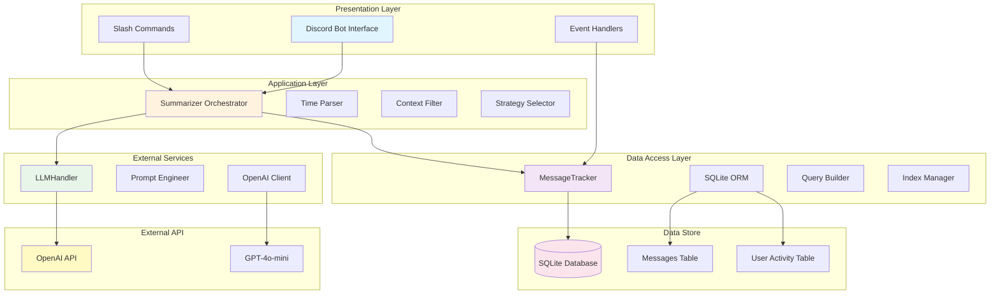
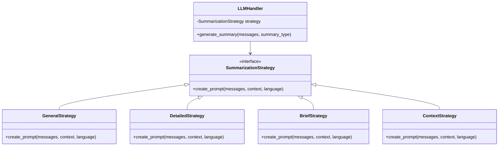
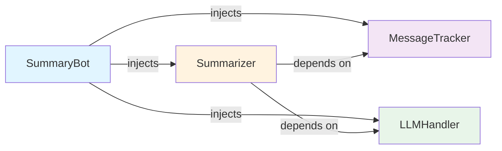
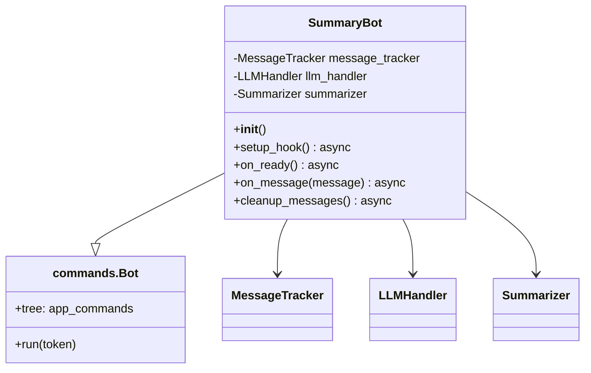
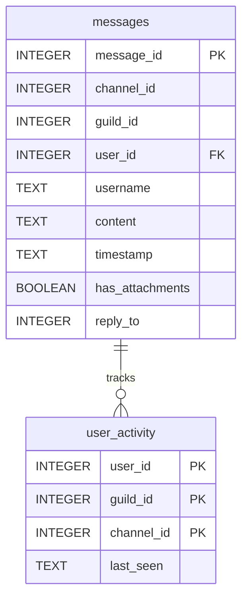
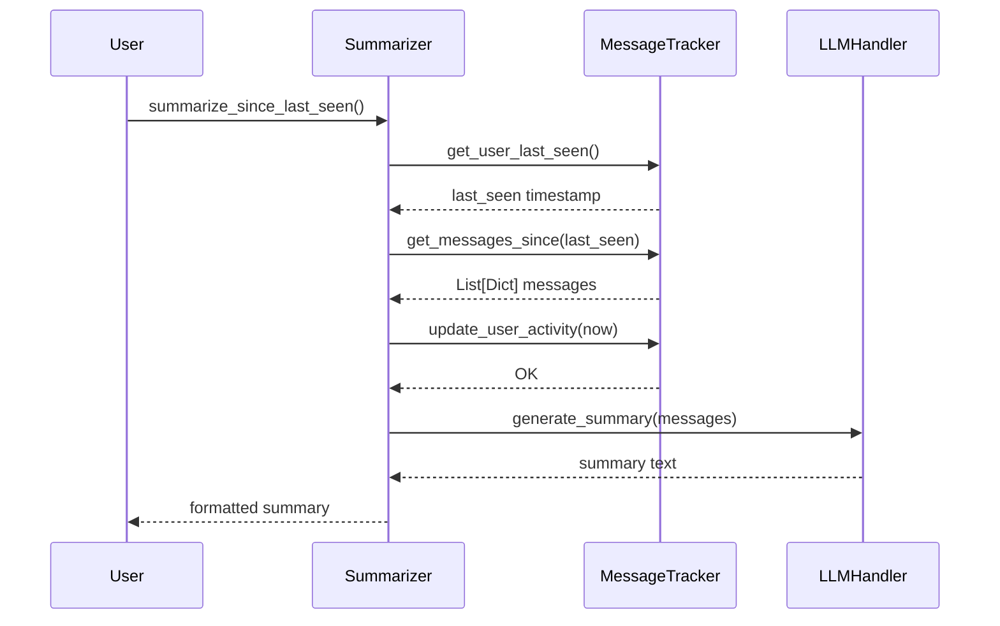
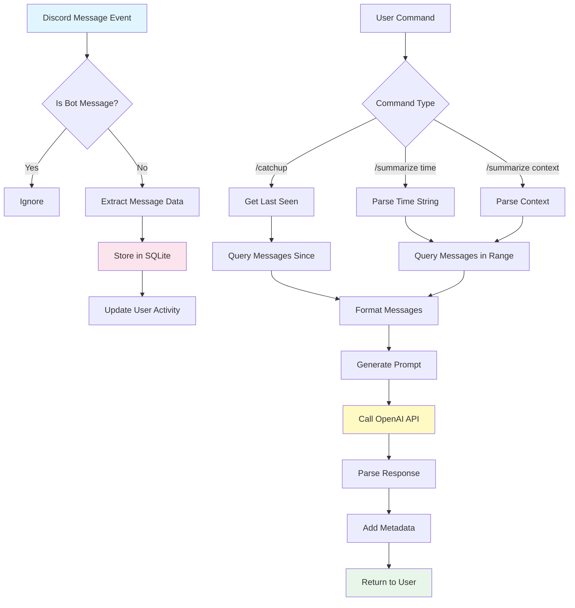
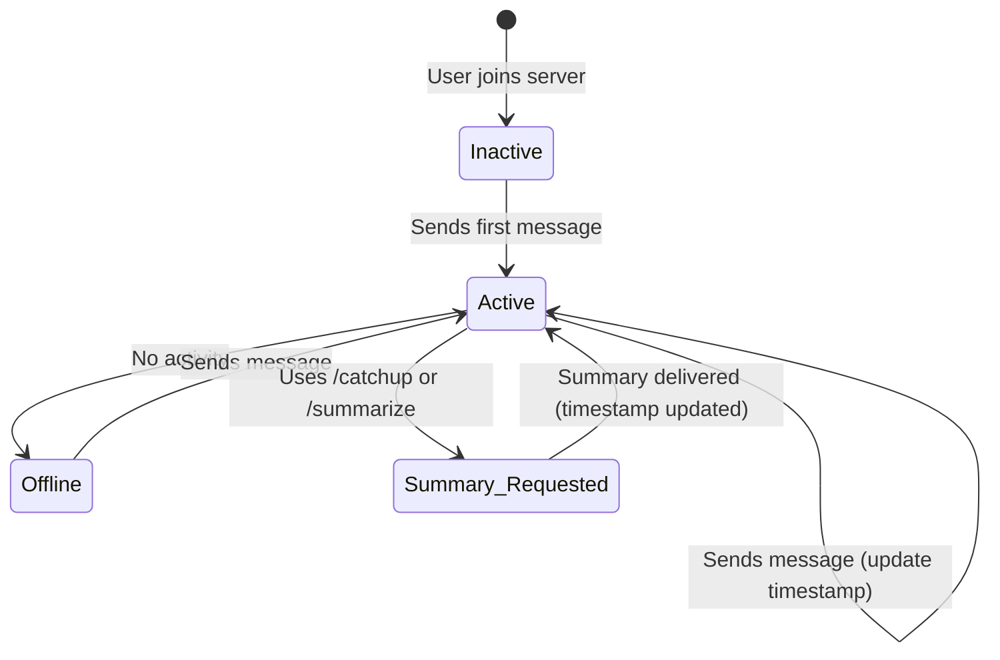
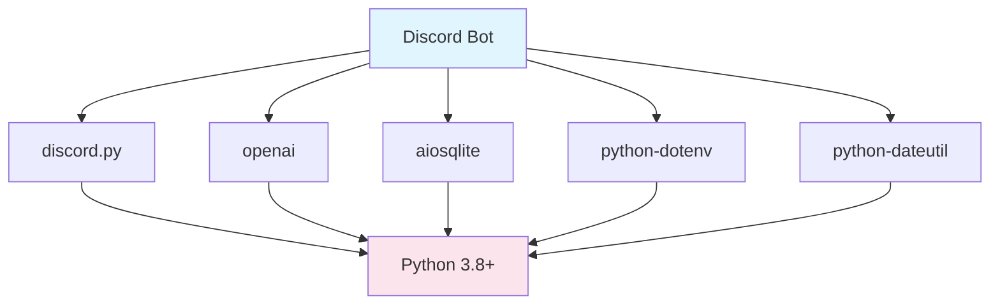

# System Architecture Documentation
# Discord LLM Chat Summarization Bot

**Document Version:** 1.0
**Last Updated:** 2025-10-26
**Target Audience:** Academic/Research

---

## Table of Contents

1. [Executive Summary](#executive-summary)
2. [Architectural Overview](#architectural-overview)
3. [Architectural Patterns](#architectural-patterns)
4. [Component Specifications](#component-specifications)
5. [Data Architecture](#data-architecture)
6. [Concurrency Model](#concurrency-model)
7. [Technology Stack](#technology-stack)
8. [Design Decisions](#design-decisions)
9. [References](#references)

---

## Executive Summary

This document presents a formal architectural analysis of a Discord-based chat summarization system that leverages Large Language Models (LLMs) for abstractive text summarization. The system implements a layered architecture pattern, combining event-driven message capture, relational data persistence, and API-based natural language processing.

**Core Capabilities:**
- Real-time message tracking across Discord channels
- User activity monitoring with temporal precision
- On-demand abstractive summarization using GPT-4o-mini
- Multi-language support (English, Indonesian)
- Contextual and temporal query-based retrieval

**Architectural Paradigm:** Layered Architecture with Asynchronous Event-Driven Processing

---

## Architectural Overview

### 1. High-Level System Architecture

#### Mermaid Diagram: System Architecture


#### ASCII Diagram: Layered Architecture
```
┌─────────────────────────────────────────────────────────────────┐
│                    PRESENTATION LAYER                           │
│  ┌──────────────────┐  ┌──────────────────┐  ┌───────────────┐ │
│  │ Discord Bot API  │  │ Slash Commands   │  │ Event System  │ │
│  │  (discord.py)    │  │  /summarize      │  │ on_message()  │ │
│  │                  │  │  /catchup        │  │ on_ready()    │ │
│  └──────────────────┘  └──────────────────┘  └───────────────┘ │
└──────────────────────────────────┬──────────────────────────────┘
                                   │
┌──────────────────────────────────┴──────────────────────────────┐
│                 APPLICATION/BUSINESS LOGIC LAYER                │
│  ┌─────────────────────────────────────────────────────────┐    │
│  │              Summarizer (Orchestrator)                  │    │
│  │  ┌──────────────┐ ┌──────────────┐ ┌───────────────┐   │    │
│  │  │ Time Parser  │ │ Context Fil. │ │ Strategy Sel. │   │    │
│  │  │ parse_time() │ │ keyword_match│ │ route_request │   │    │
│  │  └──────────────┘ └──────────────┘ └───────────────┘   │    │
│  └─────────────────────────────────────────────────────────┘    │
└─────────────────┬─────────────────────────┬─────────────────────┘
                  │                         │
        ┌─────────┴────────┐      ┌────────┴──────────┐
        │                  │      │                   │
┌───────┴──────────────────┴──┐ ┌─┴───────────────────┴───────┐
│    DATA ACCESS LAYER        │ │  EXTERNAL SERVICES LAYER    │
│  ┌────────────────────────┐ │ │  ┌────────────────────────┐ │
│  │   MessageTracker       │ │ │  │     LLMHandler         │ │
│  │  ┌──────────────────┐  │ │ │  │  ┌──────────────────┐  │ │
│  │  │ store_message()  │  │ │ │  │  │ Prompt Engineer  │  │ │
│  │  │ get_messages()   │  │ │ │  │  │ create_prompt()  │  │ │
│  │  │ update_activity()│  │ │ │  │  │ generate_summary │  │ │
│  │  └──────────────────┘  │ │ │  │  └──────────────────┘  │ │
│  └────────────────────────┘ │ │  └────────────────────────┘ │
└─────────────┬───────────────┘ └─────────────┬────────────────┘
              │                               │
    ┌─────────┴──────────┐          ┌────────┴──────────┐
    │                    │          │                   │
┌───┴────────────────────┴───┐  ┌──┴───────────────────┴────┐
│   PERSISTENCE LAYER        │  │   EXTERNAL API            │
│  ┌──────────────────────┐  │  │  ┌─────────────────────┐  │
│  │   SQLite Database    │  │  │  │   OpenAI API        │  │
│  │  ┌────────────────┐  │  │  │  │  ┌───────────────┐  │  │
│  │  │ messages table │  │  │  │  │  │  GPT-4o-mini  │  │  │
│  │  │ user_activity  │  │  │  │  │  │  Completions  │  │  │
│  │  │ indexes        │  │  │  │  │  └───────────────┘  │  │
│  │  └────────────────┘  │  │  │  └─────────────────────┘  │
│  └──────────────────────┘  │  └──────────────────────────┘ │
└────────────────────────────┘                                │
                                                              │
```

### 2. Architectural Style

**Primary Pattern:** **Layered Architecture** (Buschmann et al., 1996)[1]

**Rationale:**
- Clear separation of concerns
- Modularity enabling independent component evolution
- Testability through layer isolation
- Scalability via horizontal scaling of individual layers

**Layer Responsibilities:**

| Layer | Responsibility | Dependencies |
|-------|---------------|--------------|
| Presentation | User interaction, command parsing | Application |
| Application | Business logic orchestration | Data Access, External Services |
| Data Access | Data persistence abstraction | Persistence |
| External Services | Third-party API integration | External API |
| Persistence | Data storage | None |

---

## Architectural Patterns

### Pattern 1: Repository Pattern

**Implementation:** `MessageTracker` class (message_tracker.py)

**Definition:** Mediates between the domain and data mapping layers, acting as an in-memory collection of domain objects (Fowler, 2002)[2].

**Application:**
```python
class MessageTracker:
    """Repository for Discord messages and user activity"""

    async def store_message(self, message):
        """Create operation"""

    async def get_messages_since(self, channel_id, since, limit):
        """Read operation with temporal filtering"""

    async def get_messages_in_timerange(self, channel_id, start, end, limit):
        """Read operation with range filtering"""

    async def cleanup_old_messages(self, days):
        """Delete operation with retention policy"""
```

**Benefits:**
- Centralized data access logic
- Query optimization in single location
- Database technology abstraction
- Simplified testing through mocking

**Database Abstraction:**
```
Application Code → MessageTracker (Repository) → SQLite (Concrete DB)
                         ↓
                   (Could swap to PostgreSQL, MongoDB, etc.)
```

---

### Pattern 2: Strategy Pattern

**Implementation:** Summary type selection in `LLMHandler`

**Definition:** Defines a family of algorithms, encapsulates each one, and makes them interchangeable (Gamma et al., 1994)[3].

**Strategies Implemented:**



**Code Implementation:**
```python
# llm_handler.py lines 36-127
def create_summary_prompt(self, messages, context, summary_type, language):
    if summary_type == "general":
        # General strategy
        system_prompt = "..."
    elif summary_type == "detailed":
        # Detailed strategy
        system_prompt = "..."
    elif summary_type == "brief":
        # Brief strategy
        system_prompt = "..."
    else:  # context
        # Context-based strategy
        system_prompt = "..."
```

**Runtime Selection:**
```
User Command → summary_type parameter → Strategy Selection → Prompt Generation
```

---

### Pattern 3: Facade Pattern

**Implementation:** `Summarizer` class

**Definition:** Provides a unified interface to a set of interfaces in a subsystem, making it easier to use (Gamma et al., 1994)[3].

**Subsystems Coordinated:**
- MessageTracker (data retrieval)
- LLMHandler (summarization)
- Time parsing logic
- Context filtering

**Facade Interface:**
```python
class Summarizer:
    def __init__(self, message_tracker: MessageTracker, llm_handler: LLMHandler):
        # Dependency injection of subsystems
        self.message_tracker = message_tracker
        self.llm_handler = llm_handler

    async def summarize_since_last_seen(self, ...):
        # Coordinates: message retrieval + LLM generation + activity update

    async def summarize_time_range(self, ...):
        # Coordinates: time parsing + message retrieval + LLM generation

    async def summarize_with_context(self, ...):
        # Coordinates: time parsing + context filtering + LLM generation
```

**Complexity Reduction:**
```
Without Facade:
  Discord Command → MessageTracker.get_messages_since()
                 → MessageTracker.update_user_activity()
                 → LLMHandler.create_summary_prompt()
                 → LLMHandler.generate_summary()
                 → Error handling
                 → Response formatting

With Facade:
  Discord Command → Summarizer.summarize_since_last_seen()
                     ↓ (handles all coordination internally)
                  Response
```

---

### Pattern 4: Dependency Injection

**Implementation:** Constructor injection in `SummaryBot` and `Summarizer`

**Definition:** A technique where one object supplies the dependencies of another object (Fowler, 2004)[4].

**Dependency Graph:**


**Code Implementation:**
```python
# bot.py lines 25-30
class SummaryBot(commands.Bot):
    def __init__(self):
        super().__init__(command_prefix='!', intents=intents)
        # Dependencies created
        self.message_tracker = MessageTracker()
        self.llm_handler = LLMHandler(OPENAI_API_KEY)
        # Injected into Summarizer
        self.summarizer = Summarizer(self.message_tracker, self.llm_handler)
```

**Benefits:**
- Loose coupling between components
- Easier unit testing (can inject mocks)
- Flexibility to swap implementations
- Clear dependency visualization

---

### Pattern 5: Template Method Pattern (Implicit)

**Implementation:** Async database operations in `MessageTracker`

**Structure:**
```python
async def _database_operation_template(self, query, params):
    """Template for all database operations"""
    async with aiosqlite.connect(self.db_path) as db:
        cursor = await db.execute(query, params)
        result = await cursor.fetchall()  # or fetchone()
        await db.commit()  # if write operation
        return result
```

**Concrete Implementations:**
- `store_message()` - Write operation
- `get_messages_since()` - Read with filtering
- `update_user_activity()` - Upsert operation
- `cleanup_old_messages()` - Delete operation

---

## Component Specifications

### Component 1: SummaryBot (bot.py)

**Type:** Main Application Controller
**Lines of Code:** 278
**Complexity:** O(1) per message event, O(n) for cleanup task

#### Responsibilities:
1. Discord API integration
2. Event loop management
3. Command routing
4. Error handling
5. Background task scheduling

#### Class Diagram:


#### Key Methods:

**1. setup_hook() - Initialization**
```python
async def setup_hook(self):
    await self.message_tracker.initialize()  # DB setup
    self.cleanup_messages.start()            # Background task
    await self.tree.sync()                   # Sync slash commands
```

**Execution Flow:**
```
Bot Start → setup_hook()
              ├─→ Initialize Database
              ├─→ Start Background Tasks
              └─→ Sync Discord Commands
```

**2. on_message() - Event Handler**
```python
async def on_message(self, message: discord.Message):
    if message.author.bot:
        return  # Filter bot messages

    if message.guild:
        await self.message_tracker.store_message(message)
        await self.message_tracker.update_user_activity(
            message.author.id, message.guild.id, message.channel.id
        )
```

**Time Complexity:** O(1) - Constant time database write
**Space Complexity:** O(1) - Fixed memory per message

**3. cleanup_messages() - Background Task**
```python
@tasks.loop(hours=24)
async def cleanup_messages(self):
    await self.message_tracker.cleanup_old_messages(MESSAGE_RETENTION_DAYS)
```

**Scheduling:** Runs every 24 hours
**Purpose:** Maintain database size within bounds

#### Command Handlers:

**Slash Command Architecture:**
```
/summarize → @bot.tree.command decorator
              ├─→ Parameter validation
              ├─→ Defer response (thinking=True)
              ├─→ Route to Summarizer
              ├─→ Handle long responses (chunk if >2000 chars)
              └─→ Error handling
```

**Error Handling Strategy:**
```python
try:
    summary = await bot.summarizer.summarize_X(...)
    await interaction.followup.send(summary)
except Exception as e:
    await interaction.followup.send(f"Error: {str(e)}")
    print(f"Error in command: {e}")  # Logging
```

---

### Component 2: MessageTracker (message_tracker.py)

**Type:** Data Access Layer / Repository
**Lines of Code:** 169
**Complexity:** O(log n) queries due to indexing

#### Database Schema:

**ERD Diagram:**


**ASCII Schema:**
```
┌─────────────────────────────────────┐
│          messages                   │
├─────────────────────────────────────┤
│ PK  message_id      INTEGER         │
│     channel_id      INTEGER  ─┐     │
│     guild_id        INTEGER   │     │
│ FK  user_id         INTEGER   │     │
│     username        TEXT      │     │
│     content         TEXT      │     │
│     timestamp       TEXT      │     │
│     has_attachments BOOLEAN   │     │
│     reply_to        INTEGER   │     │
└─────────────────────────────────────┘
                                 │
                                 │ (composite FK)
                                 │
┌─────────────────────────────────────┐
│        user_activity                │
├─────────────────────────────────────┤
│ PK  user_id         INTEGER  ───────┘
│ PK  guild_id        INTEGER         │
│ PK  channel_id      INTEGER         │
│     last_seen       TEXT            │
└─────────────────────────────────────┘
```

#### Indexing Strategy:

**Indexes Created:**
```sql
CREATE INDEX idx_channel_timestamp ON messages(channel_id, timestamp);
CREATE INDEX idx_guild_timestamp ON messages(guild_id, timestamp);
```

**Query Optimization:**
```
Query: SELECT * FROM messages WHERE channel_id = ? AND timestamp > ?
Index: idx_channel_timestamp (channel_id, timestamp)
Result: O(log n) lookup instead of O(n) table scan
```

**Index Selection Rationale:**
- `channel_id + timestamp`: Most common query pattern (time-based retrieval)
- Composite index: Covers both WHERE and ORDER BY clauses
- Cardinality: High selectivity on timestamp, good for range queries

#### CRUD Operations:

**Create: store_message()**
```python
async def store_message(self, message):
    async with aiosqlite.connect(self.db_path) as db:
        await db.execute("""
            INSERT OR REPLACE INTO messages
            (message_id, channel_id, guild_id, user_id, username,
             content, timestamp, has_attachments, reply_to)
            VALUES (?, ?, ?, ?, ?, ?, ?, ?, ?)
        """, (message.id, ...))
        await db.commit()
```

**Transaction Semantics:** ACID-compliant via SQLite
**Concurrency:** aiosqlite provides async connection pooling

**Read: get_messages_since()**
```python
async def get_messages_since(self, channel_id, since, limit):
    async with aiosqlite.connect(self.db_path) as db:
        cursor = await db.execute("""
            SELECT message_id, user_id, username, content, timestamp,
                   has_attachments, reply_to
            FROM messages
            WHERE channel_id = ? AND timestamp > ?
            ORDER BY timestamp ASC
            LIMIT ?
        """, (channel_id, since.isoformat(), limit))
        rows = await cursor.fetchall()
        return [self._row_to_dict(row) for row in rows]
```

**Query Plan:**
```
1. Use idx_channel_timestamp to find rows where channel_id = X
2. Filter rows where timestamp > Y (index scan)
3. Order by timestamp ASC (already sorted by index)
4. Limit to N rows
```

**Time Complexity:** O(log n + k) where k = result set size
**Space Complexity:** O(k)

**Delete: cleanup_old_messages()**
```python
async def cleanup_old_messages(self, days):
    cutoff = datetime.utcnow() - timedelta(days=days)
    async with aiosqlite.connect(self.db_path) as db:
        await db.execute("""
            DELETE FROM messages WHERE timestamp < ?
        """, (cutoff.isoformat(),))
        await db.commit()
```

**Deletion Strategy:** Bulk delete based on retention policy
**Performance:** O(m) where m = messages older than cutoff

---

### Component 3: LLMHandler (llm_handler.py)

**Type:** External Service Integration Layer
**Lines of Code:** 221
**Complexity:** O(n) where n = token count

#### Architecture:

```
LLMHandler
  ├─→ Prompt Engineering
  │     ├─→ System Prompt Selection
  │     ├─→ User Prompt Formatting
  │     └─→ Language Localization
  │
  ├─→ OpenAI Client Management
  │     ├─→ API Key Configuration
  │     ├─→ Request Formation
  │     └─→ Response Parsing
  │
  └─→ Error Handling
        ├─→ API Failures
        ├─→ Token Limits
        └─→ Rate Limiting
```

#### Prompt Engineering:

**Prompt Structure:**
```
┌─────────────────────────────────────────┐
│         System Prompt                   │
│  - Role definition                      │
│  - Task description                     │
│  - Output format instructions           │
│  - Constraints (length, style)          │
└─────────────────────────────────────────┘
              +
┌─────────────────────────────────────────┐
│         User Prompt                     │
│  - Formatted message history            │
│  - Specific query/request               │
│  - Context (if applicable)              │
└─────────────────────────────────────────┘
              ↓
        OpenAI API Request
              ↓
        Generated Summary
```

**Message Formatting:**
```python
# llm_handler.py lines 22-28
formatted_messages = []
for msg in messages:
    timestamp = msg['timestamp'].split('T')[1][:5]  # HH:MM
    content = msg['content'] if msg['content'] else "[attachment]"
    formatted_messages.append(f"[{timestamp}] {msg['username']}: {content}")

messages_text = "\n".join(formatted_messages)
```

**Format Example:**
```
Input:  [{'timestamp': '2025-10-26T14:23:45', 'username': 'Alice', 'content': 'Hello'}]
Output: "[14:23] Alice: Hello"
```

**Rationale:**
- Timestamp context: Helps LLM understand temporal relationships
- Username attribution: Enables participant tracking
- Compact format: Reduces token usage

#### API Integration:

**Request Configuration:**
```python
response = self.client.chat.completions.create(
    model="gpt-4o-mini",              # Model selection
    messages=[
        {"role": "system", "content": system_prompt},
        {"role": "user", "content": user_prompt}
    ],
    max_tokens=500,                   # Output limit
    temperature=0.7                   # Creativity parameter
)
```

**Parameter Justification:**

| Parameter | Value | Rationale |
|-----------|-------|-----------|
| model | gpt-4o-mini | Cost-effectiveness (~15x cheaper than GPT-4) |
| max_tokens | 500 (general), 200 (quick) | Balance detail vs. cost |
| temperature | 0.7 | Balanced creativity/consistency |

**Token Budget Analysis:**
```
Input Tokens:  System Prompt (~150) + User Prompt (~50-5000) + Messages
Output Tokens: 200-500 (controlled by max_tokens)
Total Cost:    $0.150/1M input + $0.600/1M output (gpt-4o-mini pricing)
```

**Cost Estimation:**
- 100 messages ≈ 5,000 tokens
- Summary ≈ 500 tokens
- Cost per summary ≈ $0.01-0.03

#### Language Support:

**Multilingual Architecture:**
```python
if language.lower() in ["indonesian", "indonesia"]:
    system_prompt = """Anda adalah asisten..."""  # Indonesian
else:
    system_prompt = """You are a helpful assistant..."""  # English
```

**Localization Coverage:**
- Prompts: Fully localized
- Error messages: Fully localized
- Metadata: Fully localized
- Output: LLM-generated in target language

---

### Component 4: Summarizer (summarizer.py)

**Type:** Business Logic / Orchestration Layer
**Lines of Code:** 204
**Complexity:** Varies by operation (detailed below)

#### Orchestration Flow:



#### Method Specifications:

**1. parse_time_string() - Temporal Parser**
```python
def parse_time_string(self, time_str: str) -> Optional[timedelta]:
    pattern = r'^(\d+)([mhd])$'
    match = re.match(pattern, time_str.lower())
    if not match:
        return None
    value = int(match.group(1))
    unit = match.group(2)
    # Convert to timedelta
```

**Grammar:**
```
time_expression := NUMBER UNIT
NUMBER          := [0-9]+
UNIT            := 'm' | 'h' | 'd'

Examples: "2h", "30m", "1d"
```

**Regex Analysis:**
- `^` and `$`: Anchors (exact match)
- `(\d+)`: Capture group for numeric value
- `([mhd])`: Capture group for unit
- Case-insensitive: `.lower()` preprocessing

**2. summarize_with_context() - Context Filtering**
```python
async def summarize_with_context(self, channel_id, context, hours_back, max_messages, language):
    # Retrieve messages in timeframe
    messages = await self.message_tracker.get_messages_in_timerange(...)

    # Keyword-based pre-filtering
    context_lower = context.lower()
    relevant_messages = [
        msg for msg in messages
        if context_lower in msg['content'].lower()
    ]

    # Adaptive filtering
    messages_to_summarize = relevant_messages if len(relevant_messages) >= 5 else messages

    # LLM-based deep filtering + summarization
    return await self.llm_handler.generate_summary(
        messages_to_summarize, context=context, summary_type="context", language=language
    )
```

**Two-Stage Filtering:**
1. **Stage 1 (Keyword):** Simple string matching (fast, low precision)
2. **Stage 2 (LLM):** Semantic understanding (slow, high precision)

**Adaptive Threshold:**
- If ≥5 keyword matches: Use filtered set
- If <5 keyword matches: Use all messages (let LLM filter semantically)

**Rationale:** Balance between token cost and accuracy

---

## Data Architecture

### Data Flow Diagram



### State Management

**User Activity State Diagram:**


**State Transitions:**
- **Inactive → Active:** First message creates user_activity record
- **Active → Active:** Each message updates `last_seen` timestamp
- **Summary_Requested:** Triggers message retrieval based on last_seen

---

## Concurrency Model

### Asynchronous Architecture

**Python Asyncio Event Loop:**
```
┌─────────────────────────────────────────┐
│         Asyncio Event Loop              │
│                                         │
│  ┌─────────────────────────────────┐   │
│  │   Coroutine Queue               │   │
│  │  ┌─────────────────────────┐    │   │
│  │  │ on_message() tasks      │    │   │
│  │  ├─────────────────────────┤    │   │
│  │  │ /summarize commands     │    │   │
│  │  ├─────────────────────────┤    │   │
│  │  │ Database operations     │    │   │
│  │  ├─────────────────────────┤    │   │
│  │  │ API calls (OpenAI)      │    │   │
│  │  └─────────────────────────┘    │   │
│  └─────────────────────────────────┘   │
│                                         │
│  Scheduler: First available task runs  │
└─────────────────────────────────────────┘
```

**Concurrency Benefits:**
- **Non-blocking I/O:** Database and API calls don't block event loop
- **Scalability:** Handle multiple users simultaneously
- **Responsiveness:** Bot remains responsive during long operations

**Async Operations:**
```python
# All I/O operations are async
await self.message_tracker.store_message(message)       # Non-blocking DB write
await self.llm_handler.generate_summary(messages)       # Non-blocking API call
await interaction.followup.send(summary)                # Non-blocking Discord API
```

### Background Tasks

**Cleanup Task Scheduling:**
```python
@tasks.loop(hours=24)
async def cleanup_messages(self):
    await self.message_tracker.cleanup_old_messages(MESSAGE_RETENTION_DAYS)
```

**Task Lifecycle:**
```
Bot Start → setup_hook()
             ├─→ cleanup_messages.start()
             │    └─→ Schedule for execution
             │
Time = 24h → Execute cleanup_messages()
             └─→ Reschedule for 24h later
```

---

## Technology Stack

### Core Technologies

| Component | Technology | Version | Purpose |
|-----------|-----------|---------|---------|
| Language | Python | 3.8+ | Main programming language |
| Discord API | discord.py | 2.3.2+ | Discord bot framework |
| LLM API | OpenAI Python SDK | 1.12.0+ | GPT model access |
| Database | SQLite via aiosqlite | 0.19.0+ | Async message persistence |
| Config | python-dotenv | 1.0.0+ | Environment management |
| Time Utils | python-dateutil | 2.8.2+ | Date/time parsing |

### Dependency Graph



### Technology Selection Rationale

**Python 3.8+:**
- Mature async/await support
- Rich NLP ecosystem
- Strong Discord library support
- Type hints for better code quality

**discord.py:**
- Most popular Python Discord library
- Excellent async support
- Active maintenance
- Comprehensive API coverage

**OpenAI SDK:**
- Official OpenAI client
- Streaming support
- Error handling
- Type safety

**SQLite + aiosqlite:**
- Zero-configuration database
- ACID compliance
- Sufficient for single-bot deployment
- Async wrapper for non-blocking I/O

---

## Design Decisions

### Decision 1: SQLite vs. PostgreSQL

**Choice:** SQLite

**Rationale:**
- **Deployment Simplicity:** No separate database server
- **Scale:** Adequate for single-bot, multi-guild deployment
- **Performance:** Sufficient for read-heavy workload with proper indexing
- **Cost:** Zero infrastructure cost

**Trade-offs:**
- **Limitation:** Not suitable for multi-bot distributed deployment
- **Migration Path:** Can upgrade to PostgreSQL if needed (Repository pattern abstracts DB)

### Decision 2: Abstractive vs. Extractive Summarization

**Choice:** Abstractive (via LLM)

**Rationale:**
- **Quality:** Generates coherent narratives from fragmented chat
- **Flexibility:** Adapts to different summary lengths and styles
- **Context Understanding:** Handles implicit references and context
- **Multi-language:** Supports translation/localization naturally

**Trade-offs:**
- **Cost:** API costs (~$0.01-0.03 per summary)
- **Latency:** 2-5 seconds vs. instant extractive methods
- **Determinism:** Slight variability in outputs

### Decision 3: Token Limit Strategy

**Choice:** 200 message limit with max_tokens=500

**Rationale:**
- **Context Window:** gpt-4o-mini supports 128k tokens, but cost increases linearly
- **Relevance:** Older messages less relevant for "catching up"
- **Cost Control:** Predictable cost per request
- **Quality:** 200 messages sufficient for comprehensive summary

**Token Budget:**
- Input: ~5,000 tokens (200 messages)
- Output: 500 tokens
- Total: ~5,500 tokens
- Cost: ~$0.015 per summary

### Decision 4: Synchronous vs. Asynchronous Architecture

**Choice:** Fully asynchronous (async/await)

**Rationale:**
- **Concurrency:** Handle multiple users without threading
- **I/O Efficiency:** Non-blocking database and API calls
- **Discord.py Design:** Discord.py is async-first
- **Scalability:** Better resource utilization

**Implementation:**
- All database operations: `async with aiosqlite.connect()`
- All API calls: `await self.client.chat.completions.create()`
- All Discord interactions: `await interaction.followup.send()`

---

## References

[1] Buschmann, F., Meunier, R., Rohnert, H., Sommerlad, P., & Stal, M. (1996). *Pattern-Oriented Software Architecture Volume 1: A System of Patterns*. Wiley.

[2] Fowler, M. (2002). *Patterns of Enterprise Application Architecture*. Addison-Wesley.

[3] Gamma, E., Helm, R., Johnson, R., & Vlissides, J. (1994). *Design Patterns: Elements of Reusable Object-Oriented Software*. Addison-Wesley.

[4] Fowler, M. (2004). "Inversion of Control Containers and the Dependency Injection pattern". martinfowler.com.

[5] Kleppmann, M. (2017). *Designing Data-Intensive Applications*. O'Reilly Media.

[6] Python Software Foundation. (2023). "asyncio — Asynchronous I/O". Python Documentation.

---

**Document End**
