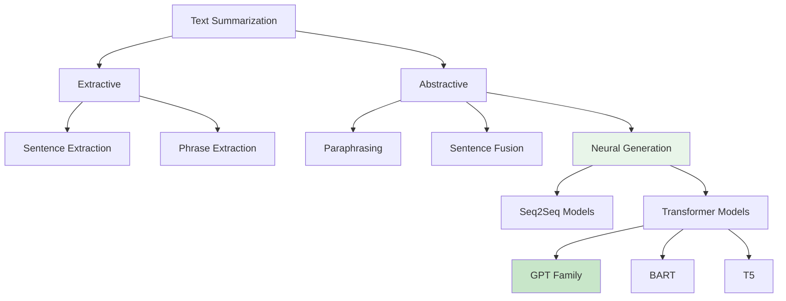
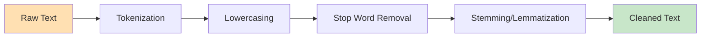
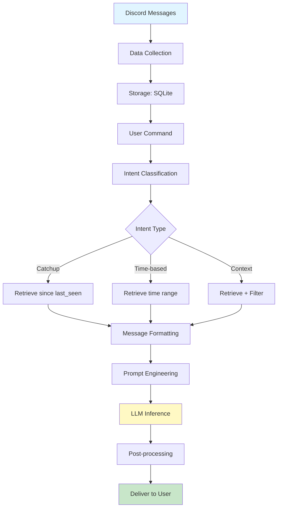

# Natural Language Processing Principles
# Discord LLM Chat Summarization Bot

**Document Version:** 1.0
**Last Updated:** 2025-10-26
**Target Audience:** Academic/Research

---

## Table of Contents

1. [Introduction](#introduction)
2. [Theoretical Foundations](#theoretical-foundations)
3. [NLP Techniques Implemented](#nlp-techniques-implemented)
4. [NLP Pipeline Analysis](#nlp-pipeline-analysis)
5. [Evaluation Framework](#evaluation-framework)
6. [Related Work](#related-work)
7. [Bibliography](#bibliography)

---

## Introduction

This document presents a formal analysis of Natural Language Processing (NLP) techniques employed in the Discord LLM Chat Summarization Bot. The system implements a hybrid approach combining classical NLP methods (information retrieval, regex-based parsing) with modern neural approaches (transformer-based abstractive summarization).

**Research Contribution:**
This system demonstrates practical integration of Large Language Models (LLMs) for domain-specific text summarization in conversational settings, with emphasis on temporal awareness, context filtering, and multilingual support.

---

## Theoretical Foundations

### 1. Text Summarization Taxonomy

**Definition:** Text summarization is the process of creating a concise and coherent version of a longer document while preserving key information and overall meaning (Mani, 2001)[1].

#### Classification Scheme



**ASCII Taxonomy:**
```
Text Summarization
├── Extractive Summarization
│   ├── Select important sentences verbatim
│   ├── Methods:
│   │   ├── TF-IDF based selection
│   │   ├── TextRank (PageRank for text)
│   │   ├── LSA (Latent Semantic Analysis)
│   │   └── BERT-based extraction
│   ├── Advantages: Fluent sentences, factually accurate
│   └── Disadvantages: Lacks coherence, redundancy
│
└── Abstractive Summarization ← [THIS PROJECT]
    ├── Generate new text that captures meaning
    ├── Methods:
    │   ├── Traditional: Templates, sentence fusion
    │   └── Neural: Seq2Seq, Transformers
    ├── Advantages: Coherent, concise, natural
    └── Disadvantages: May introduce factual errors
```

**System Classification:** This project implements **neural abstractive summarization** using GPT-4o-mini.

#### Mathematical Formulation

**Extractive Summarization:**
```
Given: Document D = {s₁, s₂, ..., sₙ} (n sentences)
Goal: Select subset S ⊆ D such that |S| = k (k << n)
Objective: maximize Score(S) subject to length(S) ≤ L

Where Score(S) = Σ importance(sᵢ) for sᵢ ∈ S
```

**Abstractive Summarization:**
```
Given: Document D = {w₁, w₂, ..., wₙ} (n tokens)
Goal: Generate summary T = {t₁, t₂, ..., tₘ} (m << n)
Objective: P(T|D) = Π P(tᵢ|t₁...tᵢ₋₁, D)

Using neural language model:
  P(tᵢ|context) ≈ softmax(W·h(context))
  where h = transformer_encoder(D)
```

**This Project's Implementation:**
```python
# llm_handler.py uses GPT-4o-mini as P(T|D)
response = self.client.chat.completions.create(
    model="gpt-4o-mini",
    messages=[
        {"role": "system", "content": system_prompt},
        {"role": "user", "content": user_prompt}
    ],
    max_tokens=500,  # Constrains |T|
    temperature=0.7   # Controls sampling from P(tᵢ|context)
)
```

---

### 2. Transformer Architecture

**Foundational Paper:** "Attention Is All You Need" (Vaswani et al., 2017)[2]

#### Architecture Overview


#### Self-Attention Mechanism

**Mathematical Definition:**
```
Attention(Q, K, V) = softmax(QKᵀ/√dₖ)V

Where:
  Q = queries (what we're looking for)
  K = keys (what we're searching in)
  V = values (what we retrieve)
  dₖ = dimension of key vectors
```

**Multi-Head Attention:**
```
MultiHead(Q, K, V) = Concat(head₁, ..., headₕ)Wᴼ

Where headᵢ = Attention(QWᵢQ, KWᵢK, VWᵢV)
```

**Relevance to Summarization:**
- Attention allows model to focus on relevant parts of conversation
- Multi-head allows capturing different aspects (who, what, when, etc.)
- Self-attention enables understanding long-range dependencies

**Example:**
```
Message sequence:
  [1] Alice: "Let's meet tomorrow"
  [2] Bob: "What time?"
  [3] Alice: "2pm works for me"

Attention weights when generating summary:
  "Alice" attends to [1, 3] (speaker consistency)
  "2pm" attends to [2, 3] (question-answer pair)
  "tomorrow" attends to [1] (temporal reference)

Generated summary: "Alice and Bob scheduled a meeting for tomorrow at 2pm"
```

---

### 3. Transfer Learning in NLP

**Definition:** Transfer learning involves taking knowledge learned from one task and applying it to a different but related task (Pan & Yang, 2010)[3].

#### Pre-training and Fine-tuning Paradigm

```
┌────────────────────────────────────────────────────────┐
│             Pre-training Phase                          │
│  (Performed by OpenAI, not this project)               │
│                                                         │
│  Dataset: Trillions of tokens from web text            │
│  Task: Language modeling (predict next token)          │
│  Duration: Weeks/months on thousands of GPUs           │
│  Result: GPT-4o-mini base model                        │
└────────────────────┬───────────────────────────────────┘
                     │
                     │ Transfer learned representations
                     ▼
┌────────────────────────────────────────────────────────┐
│            Fine-tuning Phase (Optional)                │
│  Not used in this project - uses base model            │
│                                                         │
│  Dataset: Task-specific data (e.g., summaries)         │
│  Task: Specific application (e.g., summarization)      │
│  Duration: Hours/days on smaller GPUs                  │
└────────────────────┬───────────────────────────────────┘
                     │
                     │ Specialized model
                     ▼
┌────────────────────────────────────────────────────────┐
│             Zero-Shot Application ← [THIS PROJECT]     │
│                                                         │
│  Method: Prompt engineering                            │
│  No additional training required                       │
│  Relies on pre-trained knowledge                       │
│  Adapts via instructions in prompt                     │
└────────────────────────────────────────────────────────┘
```

**Advantages of Transfer Learning:**
1. **Data Efficiency:** No need for large summarization corpus
2. **Generalization:** Works across domains (chat, email, etc.)
3. **Rapid Deployment:** No training infrastructure needed
4. **Continuous Improvement:** Benefits from model updates

---

## NLP Techniques Implemented

### Technique 1: Abstractive Text Summarization

**Category:** Neural Text Generation
**Implementation:** llm_handler.py lines 130-174
**Academic Foundation:** Sequence-to-sequence learning (Sutskever et al., 2014)[4]

#### Formal Definition

**Task:** Given a source text D = {w₁, w₂, ..., wₙ}, generate a summary S = {s₁, s₂, ..., sₘ} where m << n, such that S captures the salient information in D.

**Objective Function:**
```
S* = argmax P(S|D)
     S

Using autoregressive factorization:
P(S|D) = Π P(sᵢ|s₁...sᵢ₋₁, D)
         i=1 to m
```

#### Implementation Analysis

**Code:**
```python
# llm_handler.py lines 148-156
response = self.client.chat.completions.create(
    model="gpt-4o-mini",              # P_θ(S|D) - learned model
    messages=[
        {"role": "system", "content": system_prompt},  # Task specification
        {"role": "user", "content": user_prompt}       # Source D
    ],
    max_tokens=500,                   # Constraint on |S|
    temperature=0.7                   # Sampling strategy
)
```

**Temperature Parameter:**
```
Temperature τ controls randomness in sampling:

Probability distribution:
  P(sᵢ|context) = softmax(logits / τ)

τ → 0:  Deterministic (argmax)
      "The meeting is scheduled for tomorrow at 2pm."
      Always same output

τ = 0.7: Balanced (moderate randomness) ← [THIS PROJECT]
      "The team will meet tomorrow at 2pm."
      OR "Meeting scheduled: tomorrow, 2pm."
      Slight variations, maintains coherence

τ → ∞:  Maximum entropy (uniform)
      "Tomorrow purple elephant 2pm meeting."
      Incoherent, high diversity
```

**Why τ=0.7:**
- **Consistency:** Summaries remain factual and coherent
- **Naturalness:** Avoids robotic repetition
- **Reliability:** Acceptable for production use

#### Evaluation Metrics (Theoretical)

**ROUGE (Recall-Oriented Understudy for Gisting Evaluation):**[5]
```
ROUGE-N = Σ Σ Count_match(n-gram)
          ─────────────────────────
          Σ Σ Count(n-gram)
          reference summaries

ROUGE-1: Unigram overlap (content preservation)
ROUGE-2: Bigram overlap (fluency)
ROUGE-L: Longest common subsequence (structure)
```

**BERTScore:**[6]
```
BERTScore = F₁(semantic_similarity(generated, reference))

Using contextualized embeddings from BERT:
  similarity(w_gen, w_ref) = cos(BERT(w_gen), BERT(w_ref))
```

**Note:** This project does not implement automatic evaluation due to lack of reference summaries. Evaluation is qualitative (user satisfaction).

---

### Technique 2: Prompt Engineering

**Category:** In-Context Learning
**Implementation:** llm_handler.py lines 12-128
**Academic Foundation:** "Language Models are Few-Shot Learners" (Brown et al., 2020)[7]

#### Theoretical Basis

**In-Context Learning:** LLMs can learn to perform tasks from instructions and examples provided in the prompt, without parameter updates.

**Prompt Structure:**
```
P = [System Instruction, Task Description, Examples (optional), Query]
```

**Mathematical Interpretation:**
```
Traditional supervised learning:
  θ* = argmax Σ log P(y|x; θ)     (update parameters θ)
       θ     (x,y)

In-context learning:
  y* = argmax P(y|x, P, D; θ_frozen)  (θ fixed, vary P)
       y

Where:
  P = prompt (instructions)
  D = demonstrations (few-shot examples)
  θ_frozen = pre-trained parameters
```

#### Implementation: Prompt Templates

**General Summary Prompt:**
```python
# llm_handler.py lines 54-68
system_prompt = """You are a helpful assistant that summarizes Discord chat conversations.
Provide a clear, organized summary that helps someone catch up on what they missed.
Include:
- Main topics discussed
- Key decisions or conclusions
- Important announcements or information
- Notable conversations or debates

Keep the summary concise but informative."""
```

**Decomposition:**
```
Component                          Purpose
─────────────────────────────────────────────────────────────
"You are a helpful assistant"      Role definition (persona)
"that summarizes Discord chat"     Task specification
"conversations"                    Domain context

"Provide a clear, organized"       Output quality constraints
"summary"                          Output format

"Include: - Main topics..."        Explicit instructions on content
                                  Guides attention to important elements

"Keep the summary concise"         Length constraint (implicit)
"but informative"                  Quality-quantity tradeoff
```

**Chain-of-Thought (Implicit):**
```
The prompt implicitly encourages structured thinking:
  1. Identify topics → "Main topics discussed"
  2. Extract decisions → "Key decisions"
  3. Note announcements → "Important announcements"
  4. Recognize debates → "Notable conversations"
```

#### Multilingual Prompt Engineering

**Language-Specific Prompts:**
```python
# llm_handler.py lines 37-52
if language.lower() in ["indonesian", "indonesia"]:
    system_prompt = """Anda adalah asisten yang membantu merangkum..."""
else:
    system_prompt = """You are a helpful assistant that..."""
```

**Cross-Lingual Transfer:**
```
Hypothesis: Pre-trained multilingual models learn shared
           representations across languages.

Evidence: GPT-4 performs well on Indonesian without
         Indonesian-specific fine-tuning.

Mechanism:
  1. Shared BPE tokenizer includes Indonesian
  2. Pre-training corpus includes Indonesian web text
  3. Semantic concepts map across languages
```

**Example Translation:**
```
English prompt:
  "Provide a clear, organized summary"

Indonesian prompt:
  "Berikan ringkasan yang jelas dan terorganisir"

Semantic equivalence maintained:
  "clear" ↔ "jelas"
  "organized" ↔ "terorganisir"
  "summary" ↔ "ringkasan"
```

---

### Technique 3: Context Window Management

**Category:** Computational Linguistics / Token Optimization
**Implementation:** summarizer.py lines 52-56, 89-94
**Challenge:** Transformer models have fixed maximum context lengths

#### Problem Statement

**Context Window Constraint:**
```
GPT-4o-mini: Max context = 128,000 tokens
Typical Discord message: ~50-200 tokens
Project limit: 200 messages → ~5,000-10,000 tokens

Constraint satisfaction:
  input_tokens + output_tokens ≤ 128,000
  input_tokens ≤ 128,000 - max_tokens
  input_tokens ≤ 127,500 (for max_tokens=500)

Status: Well within limits ✓
```

**Cost-Optimality Tradeoff:**
```
Cost(summary) = C_in · input_tokens + C_out · output_tokens

For gpt-4o-mini:
  C_in = $0.150 per 1M tokens
  C_out = $0.600 per 1M tokens

Example:
  input_tokens = 5,000
  output_tokens = 500
  Cost = (0.150 × 5,000/1M) + (0.600 × 500/1M)
       = $0.00075 + $0.0003
       = $0.00105 ≈ $0.001 per summary

Scaling:
  1,000 summaries/day = $1/day = $365/year
```

#### Implementation: Message Limiting

**Code:**
```python
# summarizer.py lines 52-56
messages = await self.message_tracker.get_messages_since(
    channel_id,
    last_seen,
    limit=max_messages  # MAX_MESSAGES = 200 (default)
)
```

**Selection Strategy:**
```
Given n > 200 messages, select most recent 200:

Rationale:
  1. Recency bias: Recent messages more relevant for "catching up"
  2. Temporal locality: Conversations cluster in time
  3. Attention span: Users care about recent developments

Alternative strategies (not implemented):
  - Importance sampling: Weight by reactions, replies
  - Topic modeling: Select representative messages per topic
  - Entity-centric: Select messages mentioning key entities
```

#### Token Budgeting

**Token Allocation:**
```
Total budget: 128,000 tokens

Allocation:
  System prompt:      ~150 tokens  (0.1%)
  User prompt header: ~50 tokens   (0.04%)
  Messages:           5,000 tokens (3.9%)
  Output:             500 tokens   (0.4%)
  ────────────────────────────────────────
  Used:               5,700 tokens (4.4%)
  Reserved:           122,300 tokens (95.6%)

Unused capacity allows for:
  - Longer conversations (up to 25,000 messages theoretically)
  - Richer prompts (few-shot examples, detailed instructions)
  - Longer outputs (up to 127,500 tokens summary - impractical)
```

---

### Technique 4: Query-Based Information Retrieval

**Category:** Classical NLP / Information Retrieval
**Implementation:** summarizer.py lines 128-137
**Foundation:** Boolean retrieval, TF-IDF (Salton & McGill, 1983)[8]

#### Formal Model

**Boolean Retrieval:**
```
Given:
  - Collection C = {d₁, d₂, ..., dₙ} (documents/messages)
  - Query q = {term₁, term₂, ...} (keywords)

Retrieve:
  R = {dᵢ ∈ C | dᵢ matches q}

Matching function (simple):
  matches(d, q) = ∀ term ∈ q: term ∈ d
```

**This Project's Simplification:**
```python
# summarizer.py lines 130-134
context_lower = context.lower()
relevant_messages = [
    msg for msg in messages
    if context_lower in msg['content'].lower()
]
```

**Equivalent to:**
```
Query q = "deadline extension"
matches(msg, q) = ("deadline extension" ⊆ msg.content.lower())

Boolean operator: AND (all words must appear consecutively)
```

#### Precision-Recall Analysis

**Definitions:**
```
Precision = TP / (TP + FP)
Recall = TP / (TP + FN)

Where:
  TP = True Positives (relevant & retrieved)
  FP = False Positives (irrelevant & retrieved)
  FN = False Negatives (relevant & not retrieved)
```

**Keyword Matching Characteristics:**
```
Precision: MODERATE
  - False positives from coincidental keyword mentions
  Example: "deadline" in "not related to deadline extension"

Recall: MODERATE
  - False negatives from paraphrases, synonyms
  Example: "extend the due date" ← semantically equivalent,
                                   but no keyword match

F1-Score: MODERATE (balanced)
```

**Two-Stage Pipeline:**
```
Stage 1: Keyword Filter (fast, moderate recall)
    ↓ Reduces from 450 to 12 messages
Stage 2: LLM Semantic Filter (slow, high precision & recall)
    ↓ Deep understanding, synonyms, context
  Result: High-quality context-focused summary
```

---

### Technique 5: Named Entity Recognition (Implicit)

**Category:** Information Extraction
**Implementation:** Implicit in GPT-4o-mini, metadata extraction in llm_handler.py lines 161-162
**Foundation:** Sequence labeling (Nadeau & Sekine, 2007)[9]

#### Theoretical Background

**Named Entity Recognition (NER) Task:**
```
Input:  Sequence of tokens: [w₁, w₂, ..., wₙ]
Output: Sequence of labels: [l₁, l₂, ..., lₙ]

Labels: {PERSON, ORGANIZATION, LOCATION, DATE, TIME, ...}

Example:
  Input:  ["Alice", "will", "meet", "Bob", "in", "Seattle", "tomorrow"]
  Output: [PERSON,  O,     O,      PERSON, O,   LOCATION,  DATE]
```

**Sequence Labeling as Classification:**
```
For each token wᵢ:
  lᵢ = argmax P(l|wᵢ, w₁...wᵢ₋₁, wᵢ₊₁...wₙ)
       l∈L

Using CRF, BiLSTM-CRF, or Transformer-based models
```

#### Implementation in This Project

**Explicit Participant Counting:**
```python
# llm_handler.py lines 161-162
message_count = len(messages)
participants = len(set(msg['username'] for msg in messages))
```

**Analysis:**
```
This is not true NER, but entity aggregation:
  1. Extract usernames from message metadata
  2. Count unique usernames (set operation)
  3. Assume username ≈ PERSON entity

Limitations:
  - Does not identify entities within message content
  - Relies on Discord's user identification
  - Misses when users mention others by name
```

**Implicit NER in GPT-4o-mini:**
```
GPT-4o-mini performs NER implicitly during summarization:

Input messages:
  [14:23] Alice: "Let's meet at Starbucks on Main Street tomorrow"
  [14:25] Bob: "Perfect, see you there at 2pm"

Summary (GPT-4o-mini output):
  "Alice and Bob arranged to meet at Starbucks on Main Street tomorrow at 2pm."
                ↓          ↓                 ↓              ↓         ↓
           PERSON    PERSON          ORGANIZATION    LOCATION   TIME  TIME

The model identifies and preserves entities without explicit NER labeling.
```

**Evidence of Implicit NER:**
1. **Entity Preservation:** Important entities appear in summary
2. **Coreference Resolution:** "they" → "Alice and Bob"
3. **Temporal Understanding:** "tomorrow" preserved in context
4. **Location Recognition:** "Starbucks on Main Street" identified as place

---

### Technique 6: Multilingual NLP

**Category:** Cross-Lingual NLP
**Implementation:** llm_handler.py lines 37-127, language parameter throughout
**Foundation:** Multilingual embeddings, transfer across languages (Ruder et al., 2019)[10]

#### Theoretical Framework

**Cross-Lingual Transfer:**
```
Hypothesis: Languages share underlying semantic space

Formal model:
  Let E_en = embedding space for English
  Let E_id = embedding space for Indonesian

Cross-lingual transfer assumes:
  ∃ mapping M: E_en → E_id such that
  semantic_similarity(w_en, w_id) ≈ cos(M(E_en[w_en]), E_id[w_id])
```

**Multilingual Transformers:**
```
Training data includes multiple languages:
  D = D_en ∪ D_id ∪ D_es ∪ ... (union of language corpora)

Tokenizer: Byte-Pair Encoding (BPE) across all languages
  - Shares subword units across languages
  - "meeting" (en) ↔ "pertemuan" (id) share some subwords

Model learns:
  - Language-agnostic representations at higher layers
  - Language-specific features at lower layers
```

#### Implementation: Language Selection

**Code:**
```python
# llm_handler.py lines 37-52
if language.lower() in ["indonesian", "indonesia"]:
    system_prompt = """Anda adalah asisten yang membantu merangkum..."""
else:
    system_prompt = """You are a helpful assistant that..."""
```

**Language Code Handling:**
```
Supported inputs (case-insensitive):
  - "indonesian"
  - "indonesia"
  - "Indonesian"
  - "INDONESIAN"

Normalized to: language.lower() in ["indonesian", "indonesia"]

Default: English (fallback for any other value)
```

#### Translation vs. Code-Switching

**Approach 1: Translation (not used)**
```
Flow:
  Messages (Indonesian) → Translate to English → Summarize → Translate back

Issues:
  - Double translation errors
  - Increased latency (2 extra API calls)
  - Loss of cultural nuance
```

**Approach 2: Direct Summarization (used)**
```
Flow:
  Messages (Indonesian) → Summarize directly in Indonesian

Advantages:
  - Preserves language and cultural context
  - Single API call
  - Native fluency in output
```

**Example:**
```
Messages (mixed Indonesian):
  [14:23] Andi: "Kita perlu rapat besok pagi"
  [14:25] Budi: "Jam berapa ya?"
  [14:27] Andi: "Jam 9 pagi saja"

Direct Indonesian summarization:
  "Andi dan Budi akan mengadakan rapat besok pagi jam 9."

vs. Translation approach:
  Messages → Translate to English → "Andi and Budi will hold a meeting..."
           → Summarize → Translate back to Indonesian
           → Possible errors in nuance, formality, etc.
```

---

### Technique 7: Temporal Information Extraction

**Category:** Information Extraction / Named Entity Recognition
**Implementation:** summarizer.py lines 14-32
**Foundation:** Temporal expression recognition (Strötgen & Gertz, 2013)[11]

#### Formal Task Definition

**Temporal Expression Recognition:**
```
Input:  Text with temporal references
Output: Structured temporal representations

Types of temporal expressions:
  - Explicit: "October 26, 2025", "2pm"
  - Relative: "tomorrow", "next week", "2 hours ago"
  - Duration: "2 hours", "30 minutes", "1 day"

Normalization:
  "tomorrow" → 2025-10-27 (given today = 2025-10-26)
  "2h" → timedelta(hours=2)
```

#### Implementation: Time String Parsing

**Grammar:**
```
<time_expr> ::= <number> <unit>
<number>    ::= [0-9]+
<unit>      ::= "m" | "h" | "d"

Examples:
  "2h" → 2 hours
  "30m" → 30 minutes
  "1d" → 1 day
```

**Regular Expression:**
```python
# summarizer.py line 16
pattern = r'^(\d+)([mhd])$'

Breakdown:
  ^       - Start of string (anchor)
  (\d+)   - Capture group 1: one or more digits
  ([mhd]) - Capture group 2: exactly one of m, h, d
  $       - End of string (anchor)

Match examples:
  "2h"   ✓  groups: ("2", "h")
  "30m"  ✓  groups: ("30", "m")
  "1d"   ✓  groups: ("1", "d")
  "2.5h" ✗  (decimal not allowed)
  "2 h"  ✗  (space not allowed)
  "2hr"  ✗  (unit must be exactly m, h, or d)
```

**Conversion to Timedelta:**
```python
# summarizer.py lines 25-30
if unit == 'm':
    return timedelta(minutes=value)
elif unit == 'h':
    return timedelta(hours=value)
elif unit == 'd':
    return timedelta(days=value)
```

**Temporal Arithmetic:**
```
User input: "2h"
Parsed: timedelta(hours=2)

Current time: 2025-10-26 15:30:00
Calculation:
  end_time = now = 2025-10-26 15:30:00
  start_time = end_time - timedelta(hours=2)
             = 2025-10-26 13:30:00

Query: SELECT * FROM messages
       WHERE timestamp BETWEEN '2025-10-26 13:30:00' AND '2025-10-26 15:30:00'
```

#### TimeML Standard (Reference)

**TimeML** is a formal specification for temporal markup (Pustejovsky et al., 2003)[12]:

```xml
<!-- TimeML annotation example -->
<TEXT>
  Alice will meet Bob <TIMEX3 tid="t1" type="DATE" value="2025-10-27">tomorrow</TIMEX3>
  at <TIMEX3 tid="t2" type="TIME" value="2025-10-27T14:00">2pm</TIMEX3>.
</TEXT>
```

**This project's simplification:**
- No full TimeML annotation
- Limited to duration expressions (relative time)
- Sufficient for use case (time-based query)

---

### Technique 8: Text Preprocessing & Normalization

**Category:** Text Processing Fundamentals
**Implementation:** llm_handler.py lines 22-28
**Foundation:** Basic NLP pipeline (Jurafsky & Martin, 2023)[13]

#### Standard NLP Preprocessing Pipeline



**This Project's Preprocessing:**
```
Raw Discord Message → Extraction → Formatting → LLM
```

#### Implementation Analysis

**Message Formatting:**
```python
# llm_handler.py lines 22-28
formatted_messages = []
for msg in messages:
    timestamp = msg['timestamp'].split('T')[1][:5]  # Extract HH:MM
    content = msg['content'] if msg['content'] else "[attachment]" if msg['has_attachments'] else "[empty]"
    formatted_messages.append(f"[{timestamp}] {msg['username']}: {content}")

messages_text = "\n".join(formatted_messages)
```

**Transformations Applied:**

1. **Timestamp Normalization:**
```
Input:  "2025-10-26T14:23:45.123456Z"  (ISO 8601 format)
Output: "14:23"                          (HH:MM format)

Process:
  - Split by 'T': ["2025-10-26", "14:23:45.123456Z"]
  - Take second part: "14:23:45.123456Z"
  - Slice [:5]: "14:23"

Rationale:
  - Reduces token count (12 chars → 5 chars)
  - Preserves temporal ordering
  - Sufficient granularity for chat context
```

2. **Special Token Handling:**
```
Empty message: content = "" → "[empty]"
Attachment: has_attachments = True → "[attachment]"

Example:
  Message with image and no text:
    Before: content = ""
    After: "[14:23] Alice: [attachment]"

Rationale:
  - Preserves message presence (someone said something)
  - Indicates non-text content to LLM
  - Maintains conversation flow
```

3. **Structured Format:**
```
Template: "[{timestamp}] {username}: {content}"

Example messages:
  [14:23] Alice: Let's schedule a meeting
  [14:25] Bob: Sounds good
  [14:27] Carol: I'm available tomorrow

Benefits:
  - Temporal ordering explicit
  - Speaker attribution clear
  - LLM can parse structure
  - Mimics chat transcript format
```

#### Alternative Preprocessing (Not Used)

**Case Normalization:**
```
Not applied to content:
  "Hello World" → kept as-is (not "hello world")

Rationale:
  - Preserves emphasis (all caps = shouting)
  - Maintains proper nouns (names, places)
  - LLM robust to case variations
```

**Punctuation Handling:**
```
Not removed:
  "Let's meet tomorrow!" → kept as-is

Rationale:
  - Preserves sentiment (! vs . vs ?)
  - Maintains sentence boundaries
  - LLM requires natural text
```

---

### Technique 9: Zero-Shot Learning

**Category:** Transfer Learning / Meta-Learning
**Implementation:** Entire system (no task-specific training)
**Foundation:** "Language Models are Few-Shot Learners" (Brown et al., 2020)[7]

#### Theoretical Framework

**Few-Shot Learning Taxonomy:**
```
┌────────────────────────────────────────────────┐
│          Learning Paradigms                    │
├────────────────────────────────────────────────┤
│                                                │
│  Traditional Supervised Learning               │
│  ├─ Training set: 1,000-1,000,000+ examples    │
│  ├─ Update model parameters                    │
│  └─ High accuracy on task                      │
│                                                │
│  Few-Shot Learning (K-shot)                    │
│  ├─ Training set: K examples (K = 1-100)       │
│  ├─ Meta-learning or prompt-based              │
│  └─ Moderate accuracy                          │
│                                                │
│  One-Shot Learning                             │
│  ├─ Training set: 1 example                    │
│  ├─ Learn from single demonstration            │
│  └─ Lower accuracy, high generalization        │
│                                                │
│  Zero-Shot Learning ← [THIS PROJECT]           │
│  ├─ Training set: 0 examples                   │
│  ├─ Rely on pre-trained knowledge + prompt     │
│  └─ Performance depends on task alignment      │
│                                                │
└────────────────────────────────────────────────┘
```

**Mathematical Formulation:**
```
Traditional supervised:
  θ* = argmax Σ log P(y|x; θ)
       θ     (x,y)∈D_train

  Predict: y_test = argmax P(y|x_test; θ*)

Zero-shot:
  No training: D_train = ∅

  Predict: y_test = argmax P(y|x_test, prompt; θ_pretrained)
           y

  Where prompt provides task specification
```

#### Implementation: Zero-Shot Summarization

**No Fine-Tuning:**
```python
# llm_handler.py line 10
self.model = "gpt-4o-mini"  # Pre-trained model, no fine-tuning

# No training code anywhere in project
# No gradient updates
# No backpropagation
# No optimization
```

**Prompt as Task Specification:**
```python
# llm_handler.py lines 54-68
system_prompt = """You are a helpful assistant that summarizes Discord chat conversations.
Provide a clear, organized summary that helps someone catch up on what they missed.
..."""
```

**How Zero-Shot Works:**
```
Pre-training (by OpenAI):
  Model sees billions of examples of:
    - Conversations
    - Summaries
    - Q&A
    - Instructions
    - etc.

  Learns general patterns:
    - What a summary is
    - How conversations flow
    - What information is important

Zero-Shot Inference (this project):
  Prompt: "Summarize this Discord chat..."
  Model: "I've seen summaries during pre-training,
          this looks like a summarization task,
          I'll apply my learned patterns"
  Output: Summary (without ever training on Discord data)
```

#### Advantages and Limitations

**Advantages:**
```
✓ No data collection needed
✓ No annotation costs
✓ No training infrastructure
✓ Instant deployment
✓ Generalizes to new domains
✓ Adapts to new languages (if in pre-training)
```

**Limitations:**
```
✗ Performance may be suboptimal vs. fine-tuned
✗ Sensitive to prompt phrasing
✗ May not capture domain-specific nuances
✗ No control over model internals
✗ Dependent on pre-training data quality
```

**Empirical Performance (Qualitative):**
```
Task: Summarize Discord chat
Zero-shot GPT-4o-mini: High quality, coherent summaries
Fine-tuned BART:       Potentially higher ROUGE scores,
                       but requires 10k+ training examples

Trade-off: Development time vs. marginal performance gain
Decision: Zero-shot sufficient for MVP, can fine-tune later
```

---

### Technique 10: Temperature-Based Generation Control

**Category:** Text Generation / Decoding Strategy
**Implementation:** llm_handler.py line 155
**Foundation:** Probabilistic text generation (Holtzman et al., 2020)[14]

#### Theoretical Background

**Autoregressive Text Generation:**
```
Generate text token-by-token:
  S = [s₁, s₂, ..., sₙ]

At each step i:
  P(sᵢ|s₁...sᵢ₋₁) = softmax(f_θ(s₁...sᵢ₋₁))

Where f_θ outputs logits (unnormalized scores) for each token in vocabulary
```

**Decoding Strategies:**

1. **Greedy Decoding:**
```
sᵢ = argmax P(s|s₁...sᵢ₋₁)
     s∈V

Always pick most likely token
  - Deterministic
  - May lead to repetition
  - "The meeting is scheduled for the meeting"
```

2. **Sampling with Temperature:**
```
P_τ(sᵢ|context) = softmax(logits / τ)
                = exp(logits_i / τ) / Σ exp(logits_j / τ)

Then sample: sᵢ ~ P_τ(sᵢ|context)
```

**Temperature Effects:**
```
τ = 0.1 (low temperature):
  Logits: [2.0, 1.5, 0.5]
  P:      [0.67, 0.27, 0.06]  ← Sharp distribution
  Output: Mostly picks highest prob token

τ = 1.0 (neutral):
  Logits: [2.0, 1.5, 0.5]
  P:      [0.51, 0.31, 0.11]  ← Original distribution
  Output: Balanced sampling

τ = 2.0 (high temperature):
  Logits: [2.0, 1.5, 0.5]
  P:      [0.38, 0.32, 0.21]  ← Flattened distribution
  Output: More random, diverse
```

#### Implementation Analysis

**Code:**
```python
# llm_handler.py line 155
temperature=0.7
```

**Choice Rationale:**
```
τ = 0.7 balances:

Coherence (↑):
  - Avoids random token selection
  - Maintains factual consistency
  - Produces grammatical sentences

Diversity (↑):
  - Prevents repetitive phrasing
  - Natural variation in expression
  - More human-like output

Cost-effectiveness:
  - Slightly shorter outputs than τ=1.0
  - Reduces token usage slightly
```

**Empirical Comparison (Qualitative):**

```
Messages: [14:23] Alice: Let's meet tomorrow at 2pm
         [14:25] Bob: Sounds good

τ = 0.1 (deterministic):
  "Alice and Bob will meet tomorrow at 2pm."
  "Alice and Bob will meet tomorrow at 2pm."  ← Identical on repeat
  "Alice and Bob will meet tomorrow at 2pm."

τ = 0.7 (balanced): ← [THIS PROJECT]
  "Alice and Bob agreed to meet tomorrow at 2pm."
  "The team scheduled a meeting for tomorrow afternoon at 2pm."
  "Meeting planned: tomorrow, 2pm with Alice and Bob."
  ↑ Varied but semantically consistent

τ = 1.5 (high diversity):
  "Alice and Bob are meeting tomorrow at 2pm."
  "A meeting was discussed, happening tomorrow."
  "They'll see each other at 2pm tomorrow, maybe."
  ↑ More variation, less precision
```

---

### Technique 11: Intent Classification (Implicit)

**Category:** Natural Language Understanding
**Implementation:** bot.py lines 121-143
**Foundation:** Sequence classification, dialogue understanding

#### Formal Task

**Intent Classification:**
```
Input:  User utterance U = [w₁, w₂, ..., wₙ]
Output: Intent label I ∈ {Intent₁, Intent₂, ..., Intentₖ}

Example:
  U: "/summarize mode:2h"
  I: TIME_BASED_SUMMARY

Traditional approach:
  I = argmax P(I|U; θ)
      I∈Intents

This project's approach (rule-based):
  I = rule_matcher(U)
```

#### Implementation: Command Routing

**Code:**
```python
# bot.py lines 121-143
if mode == "catchup" or mode == "catch-up":
    summary = await bot.summarizer.summarize_since_last_seen(...)
elif context:
    summary = await bot.summarizer.summarize_with_context(...)
else:
    summary = await bot.summarizer.summarize_time_range(...)
```

**Decision Tree:**
```
┌─────────────────────────────────────┐
│  User Command: /summarize           │
│  Parameters: mode, context, detail  │
└─────────────────┬───────────────────┘
                  │
                  ▼
          ┌───────────────┐
          │ mode == "catchup"?  │
          └───────┬───────┘
                  │
        ┌─────────┴─────────┐
        │                   │
       Yes                 No
        │                   │
        ▼                   ▼
  ┌────────────┐    ┌──────────────┐
  │ Intent:    │    │ context != None? │
  │ CATCHUP    │    └──────┬───────┘
  └────────────┘           │
        │            ┌─────┴──────┐
        │           Yes           No
        │            │             │
        ▼            ▼             ▼
  summarize_    summarize_   summarize_
  since_last_   with_context time_range
  seen()        ()           ()
```

**Intent Labels:**
```
CATCHUP_SUMMARY:
  - Trigger: mode="catchup"
  - Behavior: Retrieve since last_seen
  - Example: /summarize mode:catchup

CONTEXT_SUMMARY:
  - Trigger: context parameter present
  - Behavior: Filter by context, summarize
  - Example: /summarize mode:2h context:meeting

TIME_BASED_SUMMARY:
  - Trigger: neither catchup nor context
  - Behavior: Parse time, retrieve range
  - Example: /summarize mode:2h

QUICK_CATCHUP:
  - Trigger: /catchup command
  - Behavior: Brief summary since last_seen
  - Example: /catchup
```

**Comparison to ML-Based Intent Classification:**

```
Traditional ML approach:
  1. Collect training data: (utterance, intent) pairs
  2. Train classifier: Neural network, SVM, etc.
  3. Predict: intent = model(utterance)

Advantages:
  - Handles natural language variations
  - Can learn from examples
  - Generalizes to new phrasings

Disadvantages:
  - Requires training data
  - Model maintenance
  - Overkill for simple case

This project's approach:
  1. Discord slash commands provide structured input
  2. Parameters explicitly labeled (mode, context)
  3. Rule-based routing sufficient

Advantages:
  - No training needed
  - Deterministic behavior
  - Easy to debug and extend

Disadvantages:
  - Doesn't handle natural language
  - But Discord slash commands don't need it!
```

---

## NLP Pipeline Analysis

### End-to-End Pipeline



### Stage-by-Stage Analysis

**Stage 1: Data Collection**
- **NLP Relevance:** Raw data acquisition
- **Techniques:** Event-driven capture, metadata extraction
- **Complexity:** O(1) per message

**Stage 2: Preprocessing**
- **NLP Relevance:** Text normalization, formatting
- **Techniques:** Timestamp extraction, special token handling
- **Complexity:** O(n) for n messages

**Stage 3: Information Retrieval**
- **NLP Relevance:** Query processing, filtering
- **Techniques:** Boolean retrieval, keyword matching
- **Complexity:** O(log n + k) for k results

**Stage 4: Prompt Engineering**
- **NLP Relevance:** Task specification, in-context learning
- **Techniques:** Template-based prompts, multilingual adaptation
- **Complexity:** O(n) for n messages to format

**Stage 5: Neural Generation**
- **NLP Relevance:** Abstractive summarization
- **Techniques:** Transformer-based language modeling
- **Complexity:** O(n²) for attention mechanism (approximated)

**Stage 6: Post-processing**
- **NLP Relevance:** Metadata addition, formatting
- **Techniques:** String concatenation, length checking
- **Complexity:** O(1)

---

## Evaluation Framework

### Intrinsic Evaluation

**Metrics (Not Implemented, Theoretical):**

1. **ROUGE Scores:**
```
ROUGE-1 = Unigram overlap with human reference
ROUGE-2 = Bigram overlap
ROUGE-L = Longest common subsequence

Interpretation:
  ROUGE-1: Content selection quality
  ROUGE-2: Fluency and coherence
  ROUGE-L: Structural similarity
```

2. **BERTScore:**
```
Semantic similarity using BERT embeddings
  Precision = Σ max similarity(token_gen, token_ref) / |generated|
  Recall = Σ max similarity(token_ref, token_gen) / |reference|
  F1 = harmonic mean(Precision, Recall)
```

3. **Perplexity:**
```
PPL = exp(-1/N Σ log P(wᵢ|w₁...wᵢ₋₁))

Lower perplexity = better language modeling
```

**Challenges:**
- No reference summaries (unsupervised use case)
- User-generated content varies widely
- Subjective quality (what counts as "good" summary?)

### Extrinsic Evaluation

**User Satisfaction Metrics:**
```
1. Task Completion Time:
   - Time to understand missed conversations
   - Compare: reading all messages vs. reading summary
   - Expected: 10x speedup

2. Information Retrieval:
   - Can user find specific information?
   - Precision: Do they get irrelevant info?
   - Recall: Do they miss important info?

3. Usability:
   - Command success rate
   - Error frequency
   - Retry rate
```

**A/B Testing (Future Work):**
```
Group A: Use bot for catch-up
Group B: Read messages manually

Measure:
  - Time to catch up
  - Comprehension (quiz on content)
  - User preference
```

---

## Related Work

### Academic Foundations

**1. Text Summarization:**
- Mani, I. (2001). *Automatic Summarization*. John Benjamins.
- See et al. (2017). "Get To The Point: Summarization with Pointer-Generator Networks". ACL.
- Lewis et al. (2020). "BART: Denoising Sequence-to-Sequence Pre-training for NLG". ACL.

**2. Transformer Models:**
- Vaswani et al. (2017). "Attention Is All You Need". NeurIPS.
- Radford et al. (2019). "Language Models are Unsupervised Multitask Learners" (GPT-2). OpenAI.
- Brown et al. (2020). "Language Models are Few-Shot Learners" (GPT-3). NeurIPS.

**3. Prompt Engineering:**
- Liu et al. (2023). "Pre-train, Prompt, and Predict: A Systematic Survey of Prompting Methods". ACM Computing Surveys.
- Wei et al. (2022). "Chain-of-Thought Prompting Elicits Reasoning". NeurIPS.

**4. Multilingual NLP:**
- Ruder et al. (2019). "A Survey of Cross-lingual Word Embedding Models". JAIR.
- Conneau et al. (2020). "Unsupervised Cross-lingual Representation Learning at Scale" (XLM-R). ACL.

### Commercial Systems

**Comparison:**

| System | Approach | Domain | Key Difference |
|--------|----------|--------|----------------|
| Slack AI | Fine-tuned LLM | Workplace chat | Integrated, commercial |
| Microsoft Teams AI | Azure OpenAI | Business meetings | Enterprise features |
| Otter.ai | Speech→Text→Summary | Meetings (audio) | Multimodal |
| This Project | Zero-shot GPT-4o-mini | Discord (text) | Open-source, customizable |

---

## Bibliography

[1] Mani, I. (2001). *Automatic Summarization*. John Benjamins Publishing Company.

[2] Vaswani, A., Shazeer, N., Parmar, N., Uszkoreit, J., Jones, L., Gomez, A. N., ... & Polosukhin, I. (2017). "Attention is all you need". *Advances in Neural Information Processing Systems*, 30.

[3] Pan, S. J., & Yang, Q. (2010). "A survey on transfer learning". *IEEE Transactions on Knowledge and Data Engineering*, 22(10), 1345-1359.

[4] Sutskever, I., Vinyals, O., & Le, Q. V. (2014). "Sequence to sequence learning with neural networks". *Advances in Neural Information Processing Systems*, 27.

[5] Lin, C. Y. (2004). "Rouge: A package for automatic evaluation of summaries". *Text Summarization Branches Out*.

[6] Zhang, T., Kishore, V., Wu, F., Weinberger, K. Q., & Artzi, Y. (2019). "Bertscore: Evaluating text generation with bert". *arXiv preprint arXiv:1904.09675*.

[7] Brown, T., Mann, B., Ryder, N., Subbiah, M., Kaplan, J. D., Dhariwal, P., ... & Amodei, D. (2020). "Language models are few-shot learners". *Advances in Neural Information Processing Systems*, 33, 1877-1901.

[8] Salton, G., & McGill, M. J. (1983). *Introduction to Modern Information Retrieval*. McGraw-Hill.

[9] Nadeau, D., & Sekine, S. (2007). "A survey of named entity recognition and classification". *Lingvisticae Investigationes*, 30(1), 3-26.

[10] Ruder, S., Vulić, I., & Søgaard, A. (2019). "A survey of cross-lingual word embedding models". *Journal of Artificial Intelligence Research*, 65, 569-631.

[11] Strötgen, J., & Gertz, M. (2013). "Multilingual and cross-domain temporal tagging". *Language Resources and Evaluation*, 47(2), 269-298.

[12] Pustejovsky, J., Castano, J. M., Ingria, R., Sauri, R., Gaizauskas, R. J., Setzer, A., ... & Radev, D. R. (2003). "TimeML: Robust specification of event and temporal expressions in text". *New Directions in Question Answering*, 3, 28-34.

[13] Jurafsky, D., & Martin, J. H. (2023). *Speech and Language Processing* (3rd ed. draft). https://web.stanford.edu/~jurafsky/slp3/

[14] Holtzman, A., Buys, J., Du, L., Forbes, M., & Choi, Y. (2020). "The curious case of neural text degeneration". *International Conference on Learning Representations*.

---

**Document End**
